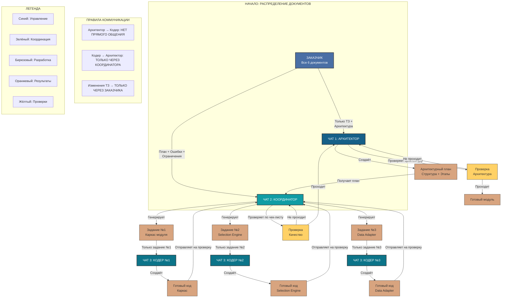

# 🎯 ФУНКЦИИ И ЗАДАЧИ КАЖДОГО ЧАТА

## **ЧАТ 1: АРХИТЕКТОР (STRATEGIST)**

### **📚 Получаемые документы:**
1. ТЗ модуля 2
2. Эталонная архитектура

### **❌ НЕ получает:**
- Список ошибок модуля 1
- Ограничения кодирования
- Инструкции проверки
- Детали БД

### **🎯 Основная функция:**
**Спроектировать архитектурный каркас, не отвлекаясь на детали реализации**

### **📋 Задачи:**
1. **Анализ ТЗ на архитектурный уровень:**
   - Выделить ключевые компоненты системы
   - Определить зависимости между компонентами
   - Выявить критичные точки интеграции

2. **Создание структуры проекта:**
   ```bash
   # Генерирует точную структуру файлов и папок
   npk-calculators/
   ├── module-fertilizer-selector/
   │   ├── includes/
   │   │   ├── class-selection-engine.php
   │   │   ├── class-ajax-handler.php
   │   │   └── ...
   │   ├── assets/
   │   └── templates/
   └── ...
   ```

3. **Определение порядка создания:**
   - Последовательность файлов (что за чем)
   - Критические зависимости (X нельзя без Y)
   - Контрольные точки архитектуры

4. **Разделение на этапы:**
   ```
   ЭТАП 1: Каркас (структура + основной файл модуля)
   ЭТАП 2: Ядро логики (Selection_Engine)
   ЭТАП 3: Транспортный слой (AJAX + Data_Adapter)
   ЭТАП 4: Интерфейс (Shortcode + Template)
   ЭТАП 5: Фронтенд (JS + CSS)
   ЭТАП 6: Интеграция и тестирование
   ```

### **📤 Выходные данные (передаётся Координатору):**
```markdown
## АРХИТЕКТУРНЫЙ ПЛАН МОДУЛЯ 2

### СТРУКТУРА:
[полное дерево файлов]

### ПОРЯДОК СОЗДАНИЯ:
1. fertilizer-selector-module.php
2. includes/class-selection-engine.php
3. includes/class-data-adapter.php
4. ...

### КРИТИЧЕСКИЕ ЗАВИСИМОСТИ:
- Selection_Engine требует NPK_Database версии 4.0
- AJAX_Handler требует Selection_Engine
- Shortcode должен регистрироваться ПОСЛЕ всех классов

### КОНТРОЛЬНЫЕ ТОЧКИ:
1. После этапа 2: Selection_Engine должен корректно рассчитывать соответствие
2. После этапа 3: AJAX должен возвращать JSON с правильной структурой
3. ...
```

---

## **ЧАТ 2: КООРДИНАТОР (COORDINATOR)**

### **📚 Получаемые документы:**
1. Архитектурный план от Архитектора
2. Список ошибок модуля 1
3. Ограничения (что нельзя делать)
4. Инструкция финальной проверки

### **❌ НЕ получает:**
- Детали реализации алгоритмов
- Код (кроме структуры)
- Технические споры о подходах

### **🎯 Основная функция:**
**Преобразовать архитектурный план в пошаговые инструкции, предотвращая известные ошибки**

### **📋 Задачи:**
1. **Создание инструкций для кодера:**
   - Поэтапные задания с чёткими требованиями
   - Конкретные "что сделать" и "что проверить"
   - Учёт ошибок модуля 1 в формулировках

2. **Разработка чек-листов контроля:**
   ```markdown
   ПРОВЕРКА ДЛЯ selection-engine.php:
   [ ] Использует NPK_Database::normalize_npk()
   [ ] Алгоритм Отиаи считает правильно (тест с Азофоской)
   [ ] Fallback-режим при <75%
   [ ] Нет прямых SQL запросов
   ```

3. **Определение критериев качества:**
   - Что считать "готовым" для каждого этапа
   - Как проверить корректность
   - Что делать при несоответствии

4. **Профилактика ошибок:**
   - Явные запреты на основе ошибок модуля 1
   - Шаблоны корректного кода (AJAX только через FormData)
   - Проверочные тест-кейсы

### **📤 Выходные данные (передаётся Кодеру):**
```markdown
## ЗАДАНИЕ №3: СОЗДАТЬ SELECTION_ENGINE.PHP

### ЦЕЛЬ:
Реализовать алгоритм Отиаи для расчёта соответствия удобрений

### ЧТО СДЕЛАТЬ:
1. Создать файл includes/class-selection-engine.php
2. Реализовать метод find_matching_fertilizers()
3. Использовать ТОЛЬКО NPK_Database:: методы
4. ...

### КАК ПРОВЕРИТЬ:
1. Тест: Томаты/Рассада + Азофоска = ~83%
2. Проверить normalisation (разные масштабы NPK)
3. Fallback при отсутствии ≥75%

### ЧЕК-ЛИСТ ПЕРЕД СДАЧЕЙ:
[ ] Все требования выполнены
[ ] Архитектура не нарушена
[ ] Ошибки модуля 1 учтены

### КРИТИЧЕСКИЕ ЗАПРЕТЫ:
❌ Не использовать прямые SQL
❌ Не дублировать normalize_npk()
❌ ...
```

---

## **ЧАТ 3: КОДЕР (DEVELOPER)**

### **📚 Получаемые документы:**
1. Конкретное задание от Координатора
2. Только для текущего этапа
3. Чек-лист проверки

### **❌ НЕ получает:**
- Полное ТЗ
- Архитектурный план (только свою часть)
- Стратегические документы
- Ошибки других модулей

### **🎯 Основная функция:**
**Реализовать код строго по инструкции, без отклонений и "улучшений"**

### **📋 Задачи:**
1. **Точное выполнение задания:**
   - Создать указанный файл
   - Реализовать указанные методы
   - Следовать указанным шаблонам

2. **Соблюдение стандартов:**
   - Именование файлов (kebab-case)
   - Структура кода (классы, методы)
   - Комментарии только по необходимости

3. **Самопроверка по чек-листу:**
   - Пройти все пункты проверки
   - Убедиться в отсутствии запрещённых конструкций
   - Проверить связи с другими файлами

4. **Передача результата:**
   - Только готовый код
   - Отметка о пройденных проверках
   - Вопросы только по неясностям в задании

### **📤 Выходные данные (готовый код):**
```php
<?php
// ВСЕГДА начинать с дебаг-заголовка из инструкции
// ============================================
// ДЕБАГ-ПРОВЕРКИ МОДУЛЯ 2: class-selection-engine.php
// ============================================

class Selection_Engine {
    /**
     * Реализация строго по заданию
     * Без отклонений, без "улучшений"
     */
    public static function find_matching_fertilizers($crop_id, $phase_id): array {
        // Код точно по требованиям
    }
}
```

---

## **🔄 ПРОЦЕСС ВЗАИМОДЕЙСТВИЯ**

### **Поток информации:**
```
Заказчик (все документы)
    ↓
Архитектор (ТЗ + Архитектура)
    ↓ создаёт структуру и этапы
Координатор (План + Ошибки + Ограничения)
    ↓ создаёт задания и чек-листы
Кодер (конкретное задание)
    ↓ пишет код
Координатор ← проверяет по чек-листу
    ↓
Заказчик ← получает готовый этап
```

### **Правила коммуникации:**
1. **Архитектор не общается с Кодером** - только через Координатора
2. **Кодер задаёт вопросы только Координатору** - не Архитектору
3. **Координатор - единственный, кто видит полную картину** после Заказчика
4. **Изменения в ТЗ** → только через Заказчика ко всем

---

## **📊 ТАБЛИЦА ОТВЕТСТВЕННОСТЕЙ**

| Роль | Что знает | Что не знает | Что производит |
|------|-----------|--------------|----------------|
| **Архитектор** | ТЗ целиком, Архитектура | Ошибки реализации, Детали кода | Структура, Этапы, Зависимости |
| **Координатор** | План, Ошибки, Ограничения | Детали алгоритмов, Код | Задания, Чек-листы, Инструкции |
| **Кодер** | Конкретное задание | Почему так, Стратегия, Полная картина | Чистый код по спецификации |

---

## **🎯 КЛЮЧЕВЫЕ ПРИНЦИПЫ РАБОТЫ**

### **Принцип "Чёрного ящика":**
- Каждый чат получает на вход только необходимое
- Выдаёт на выход только свой продукт
- Не пытается делать работу других

### **Принцип "Одного источника истины":**
- БД → только из npk-database.php
- Архитектура → только из эталонного документа
- Требования → только из ТЗ

### **Принцип "Проверки на стыках":**
- Координатор проверяет, что код соответствует архитектуре
- Архитектор проверяет, что структура соответствует ТЗ
- Кодер проверяет только своё задание

---


# 🎯 **СХЕМА ВЗАИМОДЕЙСТВИЯ ЧАТОВ**



# 📋 **ПОЯСНЕНИЯ К СХЕМЕ**

## **🔀 НАПРАВЛЕНИЯ ПОТОКОВ:**
```
───────→  Документы и задания
────·─→  Готовый код
─ ─ ─ →  Проверка и обратная связь
```

## **🎯 КЛЮЧЕВЫЕ ПРИНЦИПЫ:**

### **1. ИЗОЛЯЦИЯ КОНТЕКСТОВ:**
- **Архитектор** не знает об ошибках кодирования
- **Кодер** не знает о стратегических решениях  
- **Координатор** - единственный "переводчик" между уровнями

### **2. ПОСЛЕДОВАТЕЛЬНОСТЬ СОЗДАНИЯ:**
```
Заказчик
    ↓ (все документы)
Архитектор → План (структура + этапы)
    ↓
Координатор → Задания + Чек-листы
    ↓       ↓       ↓
Кодер1   Кодер2   Кодер3  (параллельно)
    ↓       ↓       ↓
Координатор ← проверяет качество
    ↓
Архитектор ← проверяет архитектуру
    ↓
Готовый модуль
```

### **3. ПАРАЛЛЕЛЬНАЯ РАБОТА КОДЕРОВ:**
```yaml
Кодер №1: # Этап 1 - Каркас
  Получает: Только задание по каркасу
  Не знает: Про алгоритм Отиаи, про AJAX

Кодер №2: # Этап 2 - Selection Engine  
  Получает: Только задание по алгоритму
  Не знает: Про структуру модуля, про CSS

Кодер №3: # Этап 3 - Data Adapter
  Получает: Только задание по адаптеру
  Не знает: Про бизнес-логику, про шорткоды
```

## **🔄 ПРОЦЕСС ПРОВЕРКИ:**

### **Уровень 1: Координатор (качество кода)**
```
Проверяет по чек-листу:
✓ Соответствует ли заданию?
✓ Учтены ли ошибки модуля 1?
✓ Соблюдены ли ограничения?
✓ Пройдены ли контрольные точки?
```

### **Уровень 2: Архитектор (архитектура)**
```
Проверяет по плану:
✓ Соответствует ли структуре?
✓ Правильные ли зависимости?
✓ Нарушены ли принципы архитектуры?
✓ Интегрируется ли с другими частями?
```

## **🚨 КРИТИЧЕСКИЕ ТОЧКИ КОНТРОЛЯ:**

### **Точка A: После Архитектора**
```
Вопрос: Можно ли по этому плану разрабатывать?
Проверка: Все ли зависимости учтены?
```

### **Точка B: После Координатора**  
```
Вопрос: Понятны ли задания кодерам?
Проверка: Все ли ошибки модуля 1 учтены?
```

### **Точка C: После каждого Кодера**
```
Вопрос: Соответствует ли код заданию?
Проверка: Проходит ли все проверки?
```

### **Точка D: Перед сдачей**
```
Вопрос: Всё ли интегрируется?
Проверка: Работает ли модуль целиком?
```

## **💡 ПРЕИМУЩЕСТВА СХЕМЫ:**

### **Для Заказчика:**
- Контроль на каждом этапе
- Минимизация переделок
- Чёткое понимание статуса

### **Для команды:**
- Каждый в своей зоне компетенции
- Нет перегрузки информацией
- Параллельная разработка

### **Для качества:**
- Двойная проверка (качество + архитектура)
- Раннее выявление проблем
- Стандартизация кода

---

## **🎮 КАК ЭТО РАБОТАЕТ НА ПРАКТИКЕ:**

### **Пример: Создание Selection Engine**
```
1. Архитектор: "Нужен класс с алгоритмом Отиаи"
2. Координатор: "Создай selection-engine.php с такими методами..."
3. Кодер №2: *пишет код строго по заданию*
4. Координатор: "Проверяю... да, соответствует"
5. Архитектор: "Проверяю архитектуру... да, интеграция с БД правильная"
6. Готово!
```


**ФУНКЦИИ ЧАТА 1 (АРХИТЕКТОР):**

1. Анализ ТЗ на архитектурный уровень
2. Выделение ключевых компонентов системы
3. Определение зависимостей между компонентами
4. Выявление критичных точек интеграции
5. Создание структуры папок проекта
6. Определение точных имен файлов
7. Установление порядка создания файлов
8. Выявление критических зависимостей
9. Разделение проекта на этапы разработки
10. Определение контрольных точек архитектуры
11. Проверка соответствия эталонной архитектуре
12. Создание архитектурного плана документа
13. Проверка интеграции с существующими модулями
14. Верификация использования БД версии 4.0
15. Контроль соблюдения принципов "чёрных ящиков"


**ФУНКЦИИ ЧАТА 2 (КООРДИНАТОР):**

1. Получение архитектурного плана от Архитектора
2. Анализ списка ошибок модуля 1
3. Изучение ограничений и запретов
4. Разделение плана на конкретные задания
5. Создание пошаговых инструкций для кодера
6. Разработка чек-листов проверки для каждого задания
7. Определение критериев качества выполнения
8. Профилактика повторения ошибок модуля 1
9. Создание шаблонов корректного кода
10. Разработка тест-кейсов для проверки
11. Формулирование явных запретов для кодера
12. Контроль соблюдения ТЗ на уровне реализации
13. Проверка готовых заданий по чек-листам
14. Координация между несколькими кодерами
15. Сборка результатов от всех кодеров
16. Первичная интеграционная проверка
17. Формирование отчёта о готовности этапа
18. Передача результатов Архитектору для финальной проверки
19. Решение спорных вопросов реализации
20. Обеспечение единого стиля кодирования


**ФУНКЦИИ ЧАТА 3 (КОДЕР):**

1. Получение конкретного задания от Координатора
2. Чтение и понимание пошаговой инструкции
3. Создание указанного файла с точным именем
4. Реализация указанных методов/функций
5. Строгое соблюдение шаблонов кода
6. Следование стандартам именования (kebab-case)
7. Соблюдение структуры классов и методов
8. Выполнение самопроверки по чек-листу
9. Проверка отсутствия запрещённых конструкций
10. Верификация связей с другими файлами
11. Написание минимально необходимых комментариев
12. Проверка корректности синтаксиса
13. Тестирование базовой функциональности
14. Добавление дебаг-заголовка из инструкции
15. Передача готового кода Координатору
16. Запрос уточнений при неясностях в задании
17. Исправление замечаний по результатам проверки
18. Обеспечение изоляции кода (только своё задание)
19. Отказ от "улучшений" и отклонений от ТЗ
20. Подтверждение выполнения всех пунктов задания


**ПРОВЕРКУ АРХИТЕКТУРЫ ВЫПОЛНЯЕТ:**

## **ЧАТ 1: АРХИТЕКТОР**

### **Что проверяет:**
1. Соответствие созданного кода архитектурному плану
2. Правильность зависимостей между компонентами
3. Соблюдение принципов эталонной архитектуры
4. Корректность интеграции с существующими модулями
5. Использование БД версии 4.0 (а не старых методов)
6. Соблюдение принципов "чёрных ящиков"
7. Отсутствие архитектурных нарушений

### **Когда проверяет:**
- После того, как Координатор проверил качество кода
- На каждом этапе разработки
- Перед финальной сборкой модуля

### **Что делает при обнаружении проблем:**
1. Возвращает код Координатору с указанием нарушений
2. Объясняет, какое архитектурное правило нарушено
3. Требует исправления до продолжения работы

---

## **РАЗДЕЛЕНИЕ ОТВЕТСТВЕННОСТИ:**

| **Тип проверки** | **Кто проверяет** | **Что проверяет** |
|-----------------|------------------|------------------|
| **Архитектура** | АРХИТЕКТОР (Чат 1) | Соответствие плану, зависимости, принципы |
| **Качество** | КООРДИНАТОР (Чат 2) | Соответствие заданию, ошибки модуля 1, чек-лист |
| **Синтаксис** | КОДЕР (Чат 3) | Корректность своего кода перед отправкой |

---

## **ПОТОК ПРОВЕРОК:**

```
КОДЕР 
  → (код) 
КООРДИНАТОР → проверка качества → проходит?
  ↓ (если проходит)
АРХИТЕКТОР → проверка архитектуры → проходит?
  ↓ (если проходит)
ГОТОВО
```

**Итог:** Архитектор - финальный арбитр архитектурной корректности, проверяет ПОСЛЕ проверки качества Координатором.


**ПРОВЕРКУ КАЧЕСТВА ПО ЧЕК-ЛИСТУ ВЫПОЛНЯЕТ:**

## **ЧАТ 2: КООРДИНАТОР**

### **Что проверяет по чек-листу:**
1. Соответствие кода конкретному заданию
2. Выполнение всех пунктов задания
3. Учёт ошибок модуля 1
4. Соблюдение ограничений и запретов
5. Правильность технической реализации (AJAX, стили и т.д.)
6. Прохождение тест-кейсов
7. Соблюдение стандартов кодирования

### **Когда проверяет:**
- Сразу после получения кода от Кодера
- Перед передачей кода Архитектору
- Для каждого задания отдельно

### **Чек-лист включает:**
```
[ ] Все требования задания выполнены
[ ] Имена файлов в kebab-case
[ ] AJAX использует FormData() (не JSON)
[ ] Статические стили только в CSS файле
[ ] Нет дублирования логики
[ ] Используются правильные методы БД
[ ] Код проходит базовые тесты
[ ] Учтены ошибки из списка ошибок модуля 1
```

---

## **ПОЛНЫЙ ЦИКЛ ПРОВЕРОК:**

```
1. КОДЕР → самопроверка (синтаксис, базовое тестирование)
   ↓
2. КООРДИНАТОР → проверка качества по чек-листу
   ↓ (если проходит)
3. АРХИТЕКТОР → проверка архитектуры
   ↓ (если проходит)
4. ГОТОВО к интеграции
```

---

## **ЧТО ПРОИСХОДИТ ПРИ НЕПРОХОЖДЕНИИ:**

### **Если Координатор отклоняет (качество):**
```
Координатор → Кодер: "Вернись, пункты 3, 5, 7 не выполнены"
Кодер → исправляет → отправляет снова
Координатор → проверяет снова
```

### **Если Архитектор отклоняет (архитектура):**
```
Архитектор → Координатор: "Нарушено архитектурное правило X"
Координатор → Кодер: "Исправь архитектурное нарушение X"
Кодер → исправляет → Координатор → Архитектор
```

**Итог:** Координатор - контролёр качества выполнения конкретного задания, проверяет ПЕРЕД передачей Архитектору.


В чем твоя задача. Тебе нужно создать промпт для создания чата, который будет специалистом по работе с этой системой. Чат должен полностью понимать суть системы, её логику, принцип работы и все важные нюансы. Чат должен уметь составлять правильные промпты для всех чатов, инструкции для пользователя, понимать как можно дальше развивать систему.
Для составления такого промпта ты сам должен ПОЛНОСТЬЮ разобраться в устройстве системы!
Тебе понятна твоя задача?