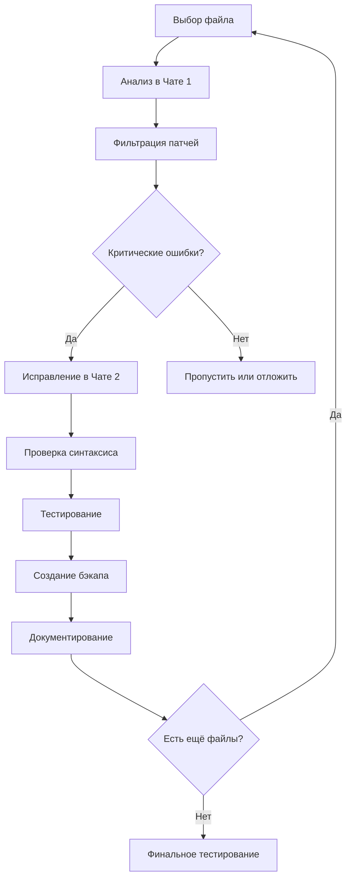

---
tags:
  - Ledgreen_ru
  - Калькулятор
  - Концентрация
  - AI
Похожее:
Сфера:
  - "[[Бизнес]]"
  - "[[IT]]"
  - "[[Web]]"
Источник:
Ссылки:
  - "[[1_Калькулятор удобрений_ред]]"
Категория:
Дата:
---
## 🎯 **ПРАВИЛЬНЫЙ ПОРЯДОК ДЕЙСТВИЙ ДЛЯ ИСПРАВЛЕНИЯ ПЛАГИНА**

### **📊 ШАГ 0: ПОДГОТОВКА И АНАЛИЗ СИТУАЦИИ**
```bash
# Создайте структуру проекта:
project/
├── original/          # Исходные файлы (НЕ ТРОГАТЬ)
├── working/           # Рабочая копия
├── patches/           # Сохранённые патчи
├── backup/            # Бэкапы на каждом этапе
└── documentation/     # Отчёты о изменениях
```

### **🔄 ШАГ 1: СОЗДАНИЕ БЕЗОПАСНОЙ СРЕДЫ**
1. **Скопируйте все файлы плагина** в `original/` (эталонная версия)
2. **Создайте рабочую копию** в `working/`
3. **Убедитесь, что есть ТЗ** в понятном формате
4. **Создайте тестовое окружение** для проверки работы плагина

### **🎯 ШАГ 2: ВЫБОР СТРАТЕГИИ ИСПРАВЛЕНИЙ**

#### **ВАРИАНТ А: ПОШАГОВОЕ ИСПРАВЛЕНИЕ (рекомендуется)**
```
Файл за файлом → Ошибка за ошибкой → Постоянная проверка
```
**Плюсы:** Безопасно, контролируемо, можно откатиться  
**Минусы:** Дольше, требует дисциплины

#### **ВАРИАНТ Б: МАССОВОЕ ИСПРАВЛЕНИЕ**
```
Всё сразу → Один большой фикс → Глобальная проверка
```
**Плюсы:** Быстрее  
**Минусы:** Рискованно, сложно отлаживать

**Рекомендую:** **Вариант А** для первого прохода, особенно если много ошибок.

---

## 📋 **ПОДРОБНЫЙ ПОШАГОВЫЙ ПЛАН**

### **🔍 ЭТАП 1: ПОДГОТОВИТЕЛЬНЫЙ (1-2 часа)**
```bash
# 1. Создайте список всех файлов плагина
find . -name "*.php" -o -name "*.js" -o -name "*.css" > files_list.txt

# 2. Определите приоритетность файлов:
#    🔴 Главные файлы (основная логика)
#    🟡 Вспомогательные файлы
#    🔵 Ресурсы (CSS/JS)
```

### **🎯 ЭТАП 2: АНАЛИЗ ФАЙЛА (на примере главного файла плагина)**

#### **ШАГ 2.1: Отправьте файл в ЧАТ №1 (Анализатор)**
```
Сообщение для Чата №1:

"Проанализируйте этот PHP файл плагина WordPress на предмет:
1. Нарушений ТЗ (прилагаю ТЗ ниже)
2. Ошибок безопасности
3. Синтаксических ошибок
4. Нарушений стандартов WordPress

ТЗ:
[ВСТАВЬТЕ ТРЕБОВАНИЯ К ПЛАГИНУ]

Файл: main-plugin.php
Код:
<?php
[ВСТАВЬТЕ ПОЛНЫЙ КОД ФАЙЛА]
?>
```

#### **ШАГ 2.2: Получите и сохраните отчёт анализатора**
```json
// Сохраните в patches/main-plugin-analysis.json
{
  "file": "main-plugin.php",
  "analysis_date": "2024-01-15",
  "total_issues": 12,
  "patches": [...] // ВСЕ рекомендации по исправлению
}
```

#### **ШАГ 2.3: Отфильтруйте и приоритизируйте исправления**
```javascript
// Создайте план исправлений:
const fixesPlan = [
  { priority: 1, type: 'security', patch: 'P001' }, // Критическая безопасность
  { priority: 2, type: 'syntax', patch: 'P002' },   // Синтаксические ошибки
  { priority: 3, type: 'tz', patch: 'P003' },       // Нарушения ТЗ
  { priority: 4, type: 'standards', patch: 'P004' }, // Стандарты
];
```

### **🔧 ЭТАП 3: ИСПРАВЛЕНИЕ ФАЙЛА**

#### **ШАГ 3.1: Начните с ВЫСОКОПРИОРИТЕТНЫХ исправлений**
Возьмите **первые 3-5 критических исправлений** из отчёта анализатора.

#### **ШАГ 3.2: Подготовьте инструкции для Чата №2**
```
Сообщение для Чата №2:

"Внесите следующие замены в файл:

ИСХОДНЫЙ ФАЙЛ:
<?php
[ТЕКУЩИЙ КОД ИЗ working/main-plugin.php]
?>

ЗАМЕНА #1:
НАЙТИ:
```
[ТОЧНЫЙ КОД ДЛЯ ПОИСКА из патча P001]
```
ЗАМЕНИТЬ НА:
```
[ИСПРАВЛЕННЫЙ КОД из патча P001]
```

ЗАМЕНА #2:
НАЙТИ:
```
[ТОЧНЫЙ КОД ДЛЯ ПОИСКА из патча P002]
```
ЗАМЕНИТЬ НА:
```
[ИСПРАВЛЕННЫЙ КОД из патча P002]
```

[И так далее для 3-5 патчей]
```

#### **ШАГ 3.3: Получите и проверьте результат**
1. **Сохраните результат** в `working/main-plugin-FIXED.php`
2. **Проверьте синтаксис:**
   ```bash
   php -l working/main-plugin-FIXED.php
   ```
3. **Создайте diff:**
   ```bash
   diff original/main-plugin.php working/main-plugin-FIXED.php > patches/main-plugin-diff-v1.patch
   ```

#### **ШАГ 3.4: Протестируйте исправления**
```php
// Быстрая проверка:
// 1. Подключите файл в тестовом окружении
// 2. Проверьте, не сломались ли базовые функции
// 3. Убедитесь, что ошибки исчезли
```

### **📝 ЭТАП 4: ДОКУМЕНТИРОВАНИЕ И КОНТРОЛЬНАЯ ТОЧКА**

#### **ШАГ 4.1: Создайте контрольную точку**
```bash
# Скопируйте исправленный файл в backup/
cp working/main-plugin-FIXED.php backup/main-plugin-v1-$(date +%Y%m%d-%H%M).php

# Сохраните применяемые патчи
echo "Применённые патчи: P001, P002, P003" > patches/main-plugin-applied-v1.txt
```

#### **ШАГ 4.2: Обновите статус**
```markdown
# Статус исправлений для main-plugin.php

## Версия: v1 (2024-01-15)

### Исправлено:
✅ [P001] SQL-инъекция в функции get_data()
✅ [P002] Отсутствие проверки nonce в AJAX обработчике  
✅ [P003] XSS уязвимость при выводе результатов

### Осталось исправить:
⚠️ [P004] Нарушение ТЗ п.3.2 (нет валидации email)
⚠️ [P005] Несоответствие стандартам WordPress
...

### Тестирование:
- [x] Синтаксис PHP корректен
- [x] Основные функции работают
- [ ] Все случаи из ТЗ покрыты
```

---

## 🗂️ **ПОЛНЫЙ РАБОЧИЙ ПРОЦЕСС ДЛЯ ВСЕГО ПЛАГИНА**

### **ЦИКЛ ОБРАБОТКИ ФАЙЛА:**


### **ПРИОРИТЕТ ФАЙЛОВ:**
1. **🔴 Уровень 1: Критические**
   - Главный файл плагина (`plugin-name.php`)
   - Файлы с обработкой AJAX
   - Файлы с работой с БД
   - Файлы административной части

2. **🟡 Уровень 2: Важные**
   - Вспомогательные классы
   - Файлы публичной части
   - Shortcode обработчики
   - Виджеты

3. **🔵 Уровень 3: Второстепенные**
   - CSS/JS файлы
   - Файлы перевода
   - Документация
   - Примеры кода

---

## ⚠️ **ВАЖНЫЕ ПРАВИЛА БЕЗОПАСНОСТИ**

### **ПРАВИЛО 1: НИКОГДА НЕ РАБОТАЙТЕ С ОРИГИНАЛАМИ**
```bash
# ПРАВИЛЬНО:
cp original/file.php working/file.php
# Исправляем working/file.php

# НЕПРАВИЛЬНО:
# Исправляем original/file.php напрямую
```

### **ПРАВИЛО 2: ЧАСТЫЕ КОНТРОЛЬНЫЕ ТОЧКИ**
```bash
# После КАЖДОГО файла создавайте бэкап:
backup/
├── main-plugin-v1-20240115-1030.php
├── main-plugin-v2-20240115-1100.php  # после дополнительных исправлений
├── ajax-handler-v1-20240115-1130.php
└── ...
```

### **ПРАВИЛО 3: ОДНО ИСПРАВЛЕНИЕ → ОДНА ПРОВЕРКА**
Не применяйте 10 патчей сразу. Порядок:
1. Примените 2-3 патча
2. Проверьте работу
3. Сделайте бэкап
4. Переходите к следующим

### **ПРАВИЛО 4: ВЕДИТЕ ЖУРНАЛ**
```markdown
# ЖУРНАЛ ИСПРАВЛЕНИЙ

## 2024-01-15
### main-plugin.php
10:30 - Начало работы
10:35 - Анализ: найдено 12 проблем
10:40 - Применены патчи P001-P003 (безопасность)
10:45 - Проверка: синтаксис OK
10:50 - Тестирование: базовые функции работают
11:00 - Создан бэкап v1
```

---

## 🔧 **ИНСТРУМЕНТЫ И ШАБЛОНЫ**

### **ШАБЛОН ДЛЯ ЧАТА №1:**
```markdown
Проанализируйте файл на предмет:

1. **Безопасность:**
   - SQL-инъекции
   - XSS уязвимости  
   - CSRF (отсутствие nonce)
   - Невалидированные пользовательские данные

2. **Соблюдение ТЗ:**
   [Укажите конкретные требования]

3. **Стандарты WordPress:**
   - Использование WP функций (sanitize_, esc_)
   - Обработка AJAX через wp_ajax_
   - Правильное подключение скриптов/стилей
   - Локализация (__(), _e())

4. **Качество кода:**
   - Обработка ошибок
   - Валидация входных данных
   - Оптимальность запросов

Файл: [имя файла]
Код:
```
[код]
```

Формат вывода: JSON с патчами
```

### **ШАБЛОН ДЛЯ ЧАТА №2:**
```markdown
Внесите следующие замены:

ИСХОДНЫЙ ФАЙЛ:
```
[полный текущий код]
```

ЗАМЕНА #1:
НАЙТИ ТОЧНО:
```
[код для поиска]
```
ЗАМЕНИТЬ НА:
```
[исправленный код]
```

[Добавьте столько замен, сколько нужно, но не более 5 за раз]
```

---

## 🧪 **ТЕСТИРОВАНИЕ ПОСЛЕ ИСПРАВЛЕНИЙ**

### **БАЗОВЫЕ ТЕСТЫ ДЛЯ КАЖДОГО ФАЙЛА:**
1. **Синтаксис:** `php -l file.php`
2. **Подключение:** Файл загружается без фатальных ошибок
3. **Функции:** Основные функции вызываются без ошибок
4. **Безопасность:** Проверьте критические места вручную

### **ИНТЕГРАЦИОННЫЕ ТЕСТЫ (после всех исправлений):**
```php
// test-basic.php
include 'working/main-plugin.php';

// Тест 1: Инициализация плагина
$plugin = new MainPlugin();
assert($plugin !== null);

// Тест 2: Основные функции
$result = $plugin->calculate(10, 20);
assert(is_numeric($result));

// Тест 3: Безопасность
$_GET['unsafe'] = "<script>alert('xss')</script>";
$safe_output = $plugin->render_output($_GET['unsafe']);
assert(strpos($safe_output, '<script>') === false);
```

---

## 📈 **ОПТИМИЗАЦИЯ ПРОЦЕССА**

### **ЕСЛИ ОЧЕНЬ МНОГО ФАЙЛОВ:**
1. **Группируйте по типу:**
   ```bash
   # Обработайте все файлы одного типа сразу
   for file in $(find . -name "*ajax*.php"); do
     # 1. Анализ
     # 2. Исправление
     # 3. Проверка
   done
   ```

2. **Используйте приоритеты:**
   - Сначала критические файлы
   - Потом файлы с наибольшим количеством ошибок
   - В конце косметические правки

3. **Автоматизируйте повторяющиеся задачи:**
   ```bash
   # Скрипт для применения патчей
   ./apply-patch.sh file.php patch.json
   ```

### **ЕСЛИ ОЧЕНЬ МНОГО ОШИБОК В ОДНОМ ФАЙЛЕ:**
1. Разбейте на этапы:
   - Этап 1: Критические ошибки безопасности
   - Этап 2: Нарушения ТЗ
   - Этап 3: Стандарты кодирования
   - Этап 4: Оптимизации

2. После каждого этапа — полное тестирование.

---

## 🚀 **БЫСТРЫЙ СТАРТ (30-МИНУТНЫЙ ПЛАН)**

### **МИНИМАЛЬНЫЙ РАБОЧИЙ ПРОЦЕСС:**
1. **Минуты 0-5:** Создайте структуру папок
2. **Минуты 5-10:** Скопируйте самый проблемный файл в `working/`
3. **Минуты 10-20:** Проанализируйте его в Чате №1
4. **Минуты 20-25:** Примените 2-3 критических исправления через Чат №2
5. **Минуты 25-30:** Проверьте результат и сделайте бэкап

### **КОМАНДЫ ДЛЯ БЫСТРОГО СТАРТА:**
```bash
#!/bin/bash
# quick-start.sh

# 1. Создаём структуру
mkdir -p {original,working,patches,backup,docs}

# 2. Копируем плагин
cp -r /путь/к/плагину/* original/

# 3. Начинаем с главного файла
cp original/plugin-main.php working/

echo "Структура создана. Начинайте с working/plugin-main.php"
```

---

## ⚠️ **ЧАСТЫЕ ОШИБКИ И КАК ИХ ИЗБЕЖАТЬ**

### **ОШИБКА 1: СЛИШКОМ МНОГО ИЗМЕНЕНИЙ ЗА РАЗ**
**❌ Неправильно:** Применить все 20 патчей сразу  
**✅ Правильно:** Применять по 3-5 патчей, проверять после каждой группы

### **ОШИБКА 2: НЕТ БЭКАПОВ**
**❌ Неправильно:** Работать напрямую с файлами  
**✅ Правильно:** Всегда иметь original/ и backup/

### **ОШИБКА 3: НЕТ ТЕСТИРОВАНИЯ**
**❌ Неправильно:** "Пофиксил и забыл"  
**✅ Правильно:** После КАЖДОГО файла — базовая проверка

### **ОШИБКА 4: ИГНОРИРОВАНИЕ ЗАВИСИМОСТЕЙ**
**❌ Неправильно:** Исправлять файлы в случайном порядке  
**✅ Правильно:** Начинать с файлов, от которых зависят другие

---

## 🏁 **ФИНАЛЬНЫЙ АЛГОРИТМ ДЕЙСТВИЙ**

### **СЕГОДНЯ (День 1):**
1. [ ] Создать структуру папок
2. [ ] Скопировать ВЕСЬ плагин в `original/`
3. [ ] Выбрать САМЫЙ ВАЖНЫЙ файл
4. [ ] Проанализировать его в Чате №1
5. [ ] Применить 3-5 критических исправлений через Чат №2
6. [ ] Протестировать, сделать бэкап

### **ЗАВТРА (День 2):**
1. [ ] Завершить исправление главного файла
2. [ ] Обработать 2-3 следующих по важности файла
3. [ ] Написать интеграционные тесты

### **НЕДЕЛЯ 1:**
1. [ ] Исправить все критические файлы
2. [ ] Протестировать весь плагин
3. [ ] Создать финальный отчёт

---

## 📞 **ЧТО ДЕЛАТЬ, ЕСЛИ...**

### **ЕСЛИ ЧАТ №1 НАШЁЛ 100+ ОШИБОК:**
1. Не паникуйте
2. Сортируйте по критичности (безопасность → ТЗ → стандарты)
3. Исправляйте по 5-10 ошибок за сессию
4. Делайте перерывы между сессиями

### **ЕСЛИ ЧАТ №2 НЕ МОЖЕТ НАЙТИ КОД:**
1. Проверьте, точно ли код совпадает
2. Убедитесь, что файл в `working/` актуальный
3. Разбейте замену на более мелкие части
4. Попробуйте найти вручную через поиск

### **ЕСЛИ ПОСЛЕ ИСПРАВЛЕНИЙ ЧТО-ТО СЛОМАЛОСЬ:**
1. Вернитесь к последнему рабочему бэкапу
2. Определите, какой патч вызвал проблему
3. Проверьте этот патч отдельно
4. Скорректируйте или разбейте на части

---

## ✅ **ЧЕК-ЛИСТ ПЕРЕД НАЧАЛОМ**

- [ ] Есть полная копия плагина в `original/`
- [ ] Рабочая копия в `working/`
- [ ] ТЗ в доступном формате
- [ ] Тестовое окружение WordPress
- [ ] Понимание приоритетов файлов
- [ ] Готовы вести журнал исправлений

---

**Стартуйте с одного файла. Сделайте его идеальным. Затем переходите к следующему.** Систематический подход спасёт вам недели отладки в будущем. Удачи! 🚀